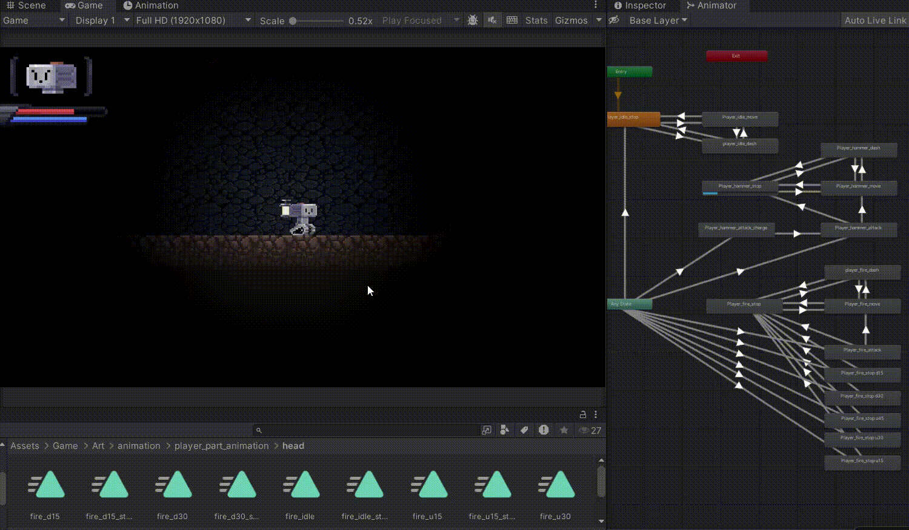
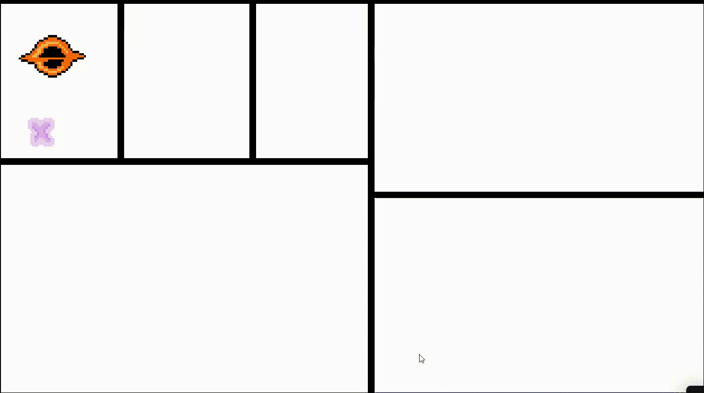

## jjong22

Hi, I'am **Jaeyoung chun**, known as `jjong22`.  
I'm an undergraduate student majoring in Computer Science & Engineering at **POSTECH**.

## 🛠 Tech Stack
- **Game Dev & Graphics:** Unity, C#, C++, OpenGL
- **Programming:** Python, C, Scala
- **Security & Infra:** Cryptography, Docker, WSL

## 🎯 Interested fields
- Game Programming & Simulation
- VR/XR Development & Interaction 
- Pixel Art & Game Directing
- Computer Security & Cryptography

---

## 🔸 Games I've Made
### [To The Star] (2024.01 - 2025.02)
> **2D Metroidvania-style Adventure Game**

- **Tech:** Unity, C#, Aseprite
- **Key Features:** 
    - **Animation & Visuals:** Designed and implemented modular part-based character animations, tilemap palettes, and particle effects (e.g., Hammer strikes).
    - **Scene Flow & Directing:** Directed in-game cinematics including the title sequence, start/ending animations, and screen transition effects.
    - **Debugging:** Identified and resolved bugs related to camera systems and player movement, in addition to animation issues.

### [Runepago] (2025 UNIJAM)
> **Survivors-like Action Game**

- **Tech:** Unity, Aseprite
- **Key Contributions:**
  - **Animation & Visuals:** Implemented dynamic combat visual effects (e.g., meteor, bomb fragments) and configured complex animator state machines with custom parameters.
  - **Scene Flow & Directing:** Orchestrated the core game flow by building the Start, Game Over, and Ending scenes, fully synchronized with UI and BGM.

## Education
- **POSTECH**, B.S. in CSE (2023.02 - )

## Work Experience
- **[Computer Security Lab @ POSTECH]** - Undergrad Intern (2025.01 - 2025.07)
- **[AUTOCRYPT]** - RED TEAM Internship (2024.06 - 2024.08)

## Activities

### 🔸 Club
- **[G-POS]**, Game dev society in POSTECH (2023.02 ~ )
- **[PLUS]**, Postech Laboratory for Unix Security (2024.02 ~ )

### 🔸 Game Development
- 2025 Nexon Dream Members
- 2025 UNIJAM
- 2024 UNICON 
- 2024 Nexon Dream Members

### 🔸 Study
- [Baekjoon] - `jason9751`
- [Dreamhack] - `jjong22`
- [CryptoHack] - `jjong22`

## Contact
- mail: `jjong22.busyless@gmail.com`
- discord: `jjong_22`
- website: [https://jjong22.github.io/]

<!-- 링크 모음 -->

[G-POS]: https://github.com/GPOS-Gamemakers-in-POSTECH
[PLUS]: https://plus.or.kr/
[AUTOCRYPT]: https://autocrypt.co.kr/
[Computer Security Lab @ POSTECH]: https://compsec.postech.ac.kr/
[To The Star]: https://github.com/GPOS-Gamemakers-in-POSTECH/GPOS-2024-to_the_STAR
[Runepago]: https://github.com/1Seong/unijam2025
[Universal scene maker for simulator]: https://github.com/jjong22/simulation-scene-maker
[https://jjong22.github.io/]: https://jjong22.github.io/

[Baekjoon]: https://solved.ac/profile/jason9751
[Dreamhack]: https://dreamhack.io/users/45064
[CryptoHack]: https://cryptohack.org/user/jjong22/
